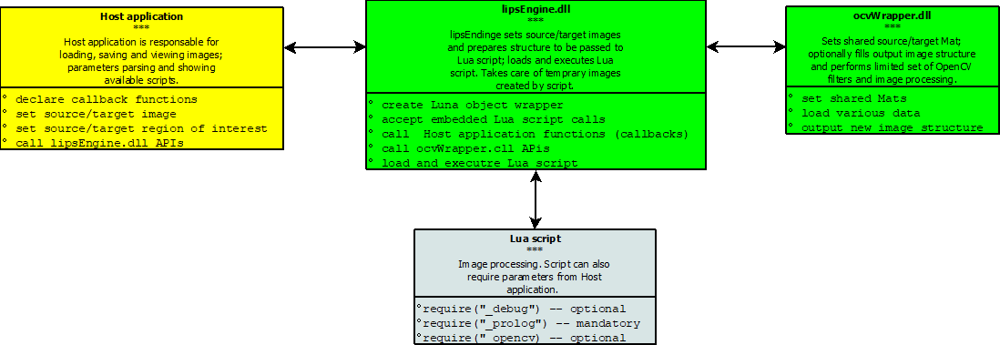
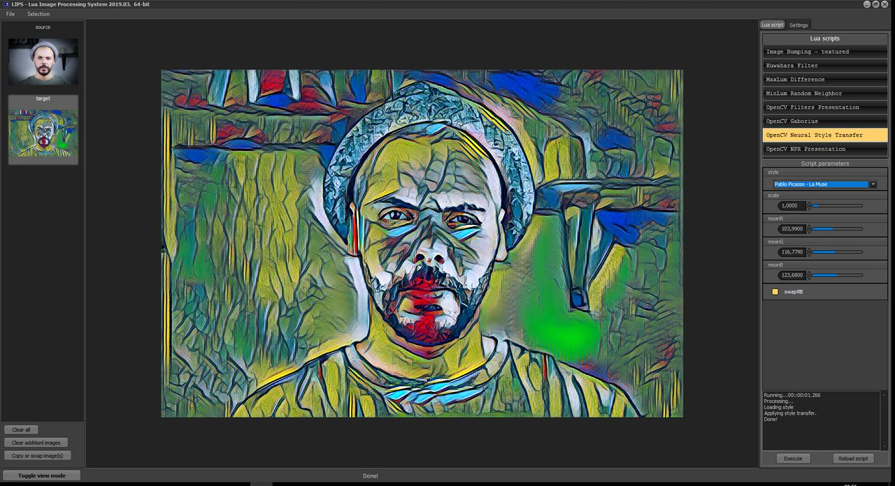
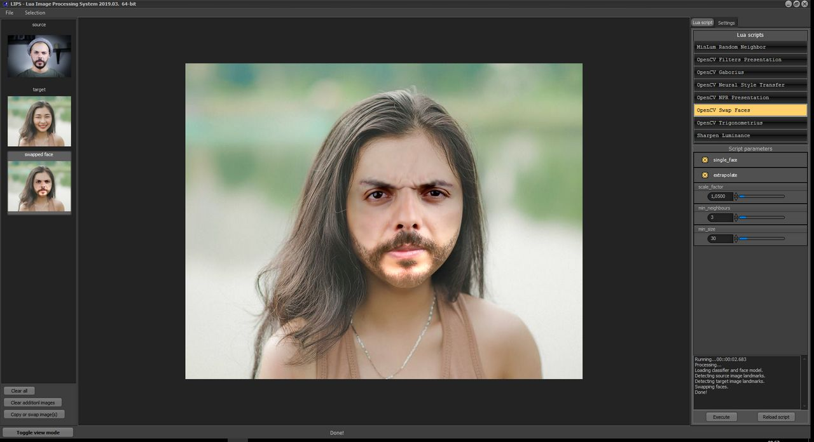
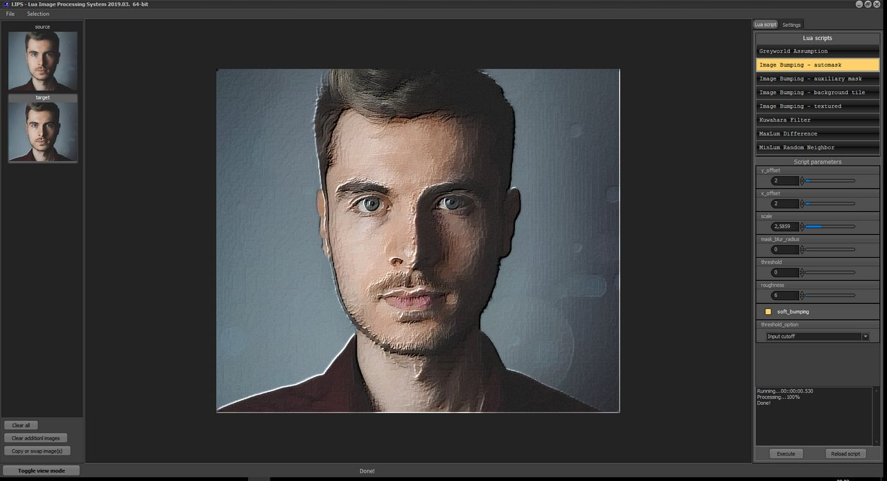
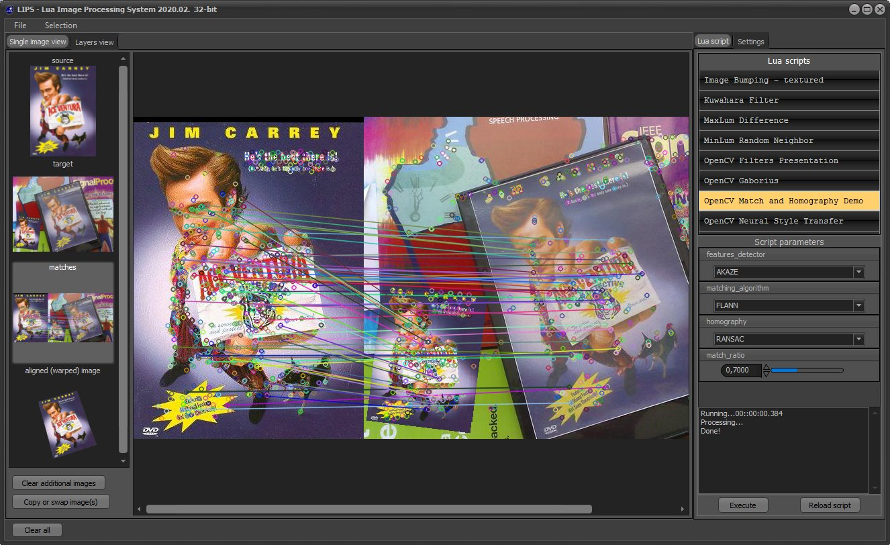

# Lips
## Lua Image Processing System
Lua Image Processing System is mainly intended to be used with Embarcadero C++/Delphi on Windows platform.
It consists of: 
1. Lips engine - lipsEngine.dll (Embarcadero 10.1. Berlin C++ project).    
2. OpenCV wrapper - ocvWrapper.dll (VS2017 project).
3. Host application - projLips.exe (Embarcadero 10.1. Berlin C++ project).
4. Lua scripts - required and example Lua scripts.

<p align='center'>
    
</p>

### Lips engine - lipsEngine.dll
This is the core of the project. It's written in Embarcadero C++, but it can be easily modified for other compilers. It uses LuaJIT  engine and ffi to pass images structure to Lua scripts. Also, it calls ocvWrapper.dll to apply a limited set of OpenCV filters from Lua script. To use this DLL from Delphi, DLL entries described in lipsEngineDLL.h must be converted to pas file, as well as structure and typedefs in lipsGlobals.h.

Lips engine currently supports RGB24 images and single channel 8-bit (grayscale) images. It can be TBitmap or any kind of image container with contiguous memory buffer. Only width, height, scanline alignement and pointer to image buffer are passed to Lips engine. Also, Lips engine supports RGB24 images with separated alpha channel, such as TIEBitmap image  (commercial product) available on www.imageen.com. Support for RGBA32 can be added as well, but currently it's not supported.

### OpenCV wrapper - ocvWrapper.dll
This dll is written in VS2017, because bcc compiler is not supported by OpenCV. It contains API calls for setting source/target image, for setting region of interesets and a limited set of OpenCV filters and image processing routines. As this dll is called from lipsEngine, after compiling and linking ocvWrapper.dll, import library must be created:

- implib -a ocvWrapper.lib ocvWrapper.dll (for 32-bit dll)
- mkexp -p ocvWrapper.a ocvWrapper.dll (for 64-bit dll)

Import libraries must be copied in OpenCV folder under lipsEngine directory.

### Host application - projLips.exe
Host (demo) application is written in Embarcadero C++ and it contains some commercial components. The source code can be modified to use standard components. From the source code, you can see how to use lipsEngine APIs and how to parse parameters requested from Lua script.

### Lua scripts
The first line in each Lua script intended for use with Lips engine must begin with `require("_prolog")` statement. The exception of this rule is if you want to debug your Lua script with let's say ZeroBrane Studio (https://studio.zerobrane.com). In this case, the first statement must be `require("_debug")`. To call OpenCV APIs (ocvWrapper.dll), you must also include opencv script `require("_opencv")`.

When script is executed, Lua engine creates following global variables:

- SourceImage (shared image from Host application)
- SourceMask (shared grayscale image from Host application) 
- TargetImage (shared image from Host application)
- TargetMask (shared grayscale image from Host application)
- SourceRoi (source image roi, initially set to complete image)
- TargetRoi (target image roi, initially set to complete image)
- CustomImage (shared image from Host application)
- CustomMask (shared grayscale image from Host application)
- ExePath (path to host application directory)
- ExeWin32 (boolean - true = 32 bit dll, false = 64 bit dll)

Lips engine uses Luna wrapper as C++ binding (source code included) and a set of call-back functions to communicate with host application. To set parameters from host application, script must declare RequireParams function and call `lips_RequireParams(S)` contained in prolog script to instruct host to set required parameters. The structure of parameter request string (S) passed to host must follow these production rule:
   ```
   S -> A
   A -> A | token
   token -> "name = type(range initial_value);"
   type  -> int | float | bool | combo | list | imagefile | imagemap
   range -> [min, max] | [v1, v2,...,vn] | []
   initial_value -> according to type, must be in the range (if range is not empty)
   Parameters request example: S = "size = int([10,20] 10);"
   Parameters request example: S = "perform_something = bool([] true);"
   ``` 
Example from OpenCV Gaborius.lua script:
```
function RequireParams()  
   lips_RequireParams("step = int([1, 32] 16); kernel_size = int([3, 101] 31);"
    .. " sigma = float([0.1, 10] 4.0); lambda = float([1, 30] 10);"
    .. " gamma = float([0.1, 10] 0.2); psi = float([0, 1.57] 0); ks_factor = float([0.001, 10] 1.5); ")
end   
```
The first parameter (step) is of type int and ranges from 1 to 32 with initial value 16. The third parameter (sigma) is of type float and it ranges from 0.1 to 10 with initial value 4.0. The host application, after parsing and validating required parameters string will create various frames and allow user to adjust parameters. When script is executed, parameter values are pushed onto stack and global Lua variables are created according to parameter names.

All required Lua scripts as well as example scripts are also distributed with binary packages. 

NOTE: data_face.zip file containes face detection and face landmarks model. data_stylemodels.zip contains neural style transfer models.
These archives must be unpacked in data/(face | stylemodels) folders under executable directory path if you don't want to modify OpenCV example scripts (face swap, neural style transfer). 

### Screenshots
Here are few screenshots of host application after executing various Lua scripts:
<p align='left'>
    </br>
    
    
    
    
        
</p>

### License
© Siniša Petrić, www.sigmapi-design.com, MIT license.

